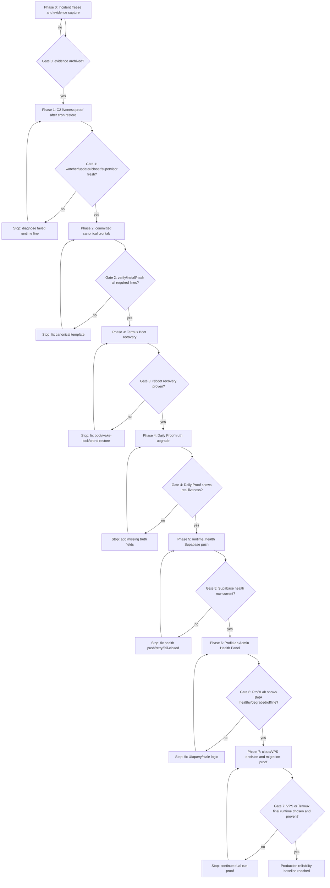

# BotA Runtime Reliability Path

Last updated: 2026-07-08

Objective: make BotA unable to fail silently.

Non-objectives:

- Do not optimize trading strategy.
- Do not change thresholds.
- Do not change H1 confirmation/veto logic.
- Do not change pair selection.
- Do not redesign ProfitLab billing/subscription/RLS.

## Path diagram

## Phase 0 — incident freeze and evidence capture

Purpose: prevent wrong assumptions.

Verified current incident:

- BotA runtime crontab was wiped/partially lost.
- Daily Proof survived independently and masked the runtime stop.
- Logs froze around 2026-06-22.

Cross-check before completion:

- Paste `crontab -l`.
- Paste mtimes for watcher/updater/closer/supervisor/API state.
- Paste Supabase active/last signal status if available.

Completion rule:

- Only complete when evidence is archived in GitHub docs.

## Phase 1 — C2 liveness proof after cron restore

Purpose: prove restored cron actually runs.

Must verify after at least one cycle:

- `logs/cron.signals.log` fresh.
- `logs/cron.indicators.log` fresh.
- `logs/cron.closer.log` fresh.
- `logs/cron.shadow.log` fresh.
- `logs/cron.supervisor.log` fresh.
- `logs/api_credits.json` changed if updater fetched.
- `state/runtime_health.json` updated.
- Required crontab lines still exactly one each.

Stop condition:

- If any log is stale, diagnose that cron line before continuing.

## Phase 2 — committed canonical crontab

Purpose: stop relying on ad-hoc crontab backups.

Required deliverables:

- A committed canonical crontab template.
- A verify/install script.
- Required line count checks.
- Crontab hash generation.
- Restore path that preserves other project blocks, including Dividend Capture Scanner.

Cross-check:

- Install script must not use `exit` in a way that closes the user's Termux session during interactive debugging.
- Must not duplicate Dividend Capture Scanner lines.
- Must keep BotA `CRON_TZ=UTC` separated from Dividend Scanner timezone.

## Phase 3 — Termux:Boot recovery

Purpose: recover after phone reboot or Android kill.

Required deliverables:

- Verify Termux:Boot app installed.
- Verify `~/.termux/boot/` exists.
- Boot script starts `termux-wake-lock`.
- Boot script starts `crond`.
- Boot script verifies/restores canonical BotA crontab if missing.
- Boot script writes a boot marker log.

Cross-check:

- Reboot test or simulated boot-script run.
- Confirm crond alive after boot.
- Confirm required crontab line counts.

## Phase 4 — Daily Proof truth upgrade

Purpose: Daily Proof must prove the signal factory is alive, not only that cron exists.

Required fields:

- crond status
- required cron line count status
- crontab hash status
- watcher log age
- updater log age
- closer log age
- shadow log age
- supervisor log age
- runtime health mode
- cache ages
- API usage
- server clock status
- last Supabase signal timestamp
- active signal count
- oldest active signal age

Cross-check:

- Force/stage one stale component and verify Daily Proof turns red/degraded.
- Ensure Telegram sends only one transition alert, not spam.

### Phase 4C closure status

Status: CLOSED / PASS.

Commit:
- `5744802` — `tools: strengthen BotA daily proof runtime reporting`

Acceptance proof:
- `tools/daily_summary.sh` now prints runtime truth fields:
  - runtime status
  - reported bot mode
  - supervisor age and timestamp
  - watcher/updater/closer/shadow ages
  - cache ages available in `runtime_health.json`
  - canonical crontab verification
  - live hash match
  - reasons
- Missing, corrupt, stale health JSON and missing verifier cases are handled without crashing the Daily Proof.
- Cron-like environment dry-run passed.
- No Telegram send during tests.
- No strategy, crontab, boot, Supabase, or ProfitLab changes.

Gate 4 result:
- Daily Proof shows real liveness: PASS.

Next phase:
- Phase 5 — runtime_health Supabase push.

## Phase 5 — runtime_health Supabase push

Purpose: make BotA status visible outside the phone.

Required deliverables:

- Supabase table or singleton row for BotA runtime health.
- BotA supervisor push script.
- Retry/backoff on network failure.
- Local health still written even if Supabase unavailable.
- No trading signal writes from the health path.

Required fields:

- `bot_id`
- `last_heartbeat_utc`
- `bot_mode`
- `crond_running`
- `required_cron_lines_ok`
- `crontab_hash`
- `watcher_log_age_min`
- `updater_log_age_min`
- `closer_log_age_min`
- `shadow_log_age_min`
- `supervisor_log_age_min`
- `api_credits_used`
- `api_credits_limit`
- `server_clock_ok`
- `clock_drift_seconds`
- `market_gate_status`
- `last_signal_created_at`
- `active_signal_count`
- `oldest_active_age_min`
- `cache_age_summary`
- `network_telegram_ok`
- `network_supabase_ok`
- `failure_reasons`

Cross-check:

- Supabase row updated within expected interval.
- Stale row becomes OFFLINE in ProfitLab.

## Phase 6 — ProfitLab Admin Health Panel

Purpose: distinguish quiet market from dead signal factory.

Required display fields:

- BotA status: HEALTHY / DEGRADED / OFFLINE
- Last heartbeat age
- Watcher age
- Updater age
- Closer age
- Supervisor age
- API credits
- Clock status
- Last signal timestamp
- Active signal count
- Failure reasons

Required reporting correction:

- Rename `Today's P&L` if it is all-time pips, or implement a true daily filter.
- Rename `30-Day Win Rate` if it is all-time win rate, or implement a true 30-day filter.

Cross-check:

- ProfitLab must show red if BotA heartbeat is stale.
- ProfitLab must not imply that no active signals means BotA is healthy.

## Phase 7 — cloud/VPS decision and migration proof

Purpose: decide whether phone Termux remains primary or a VPS becomes primary.

Decision options:

1. Termux remains primary; VPS/ProfitLab only observes health.
2. VPS becomes primary; Termux becomes backup/admin.
3. Dual-run temporary validation, then choose one primary.

Why a VPS helps:

- Removes Android sleep/reboot/battery-optimization problems.
- Removes dependence on mobile/ship internet.
- Enables systemd timers, journald logs, and external monitoring.

What a VPS does not solve:

- Broker/data-provider outage.
- Telegram/Supabase outage.
- Bad credentials.
- API credits exhausted.
- Bad code or bad cron template.

Cross-check:

- If VPS is chosen, run BotA and Dividend Capture Scanner as separate services/timers with isolated env/logs.
- Prove one full market session before cutting over.
- Ensure no double-publishing to Supabase during dual-run.

## Final release gate

Production reliability baseline is reached only when:

- C2 liveness passes.
- Canonical crontab is committed and verified.
- Boot recovery is proven.
- Daily Proof reports real component freshness.
- Runtime health reaches Supabase.
- ProfitLab displays BotA health.
- Silent failure produces a red state within the defined threshold.
