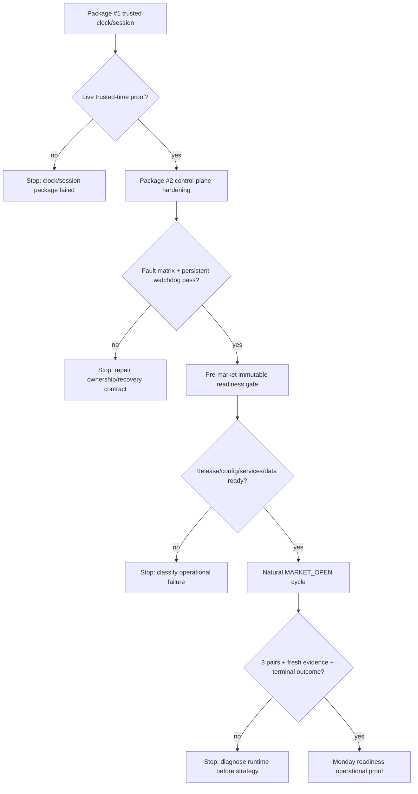

# BotA Runtime Reliability Path

Last updated: **2026-08-09 UTC**

Objective: make BotA unable to fail silently while preserving one production owner per job and keeping strategy changes outside reliability work.

Current detailed evidence: `audits/PACKAGE1_CLOCK_AND_PACKAGE2_CONTROL_PLANE_2026-08-09.md`.

## Non-objectives

- Do not optimize the trading strategy.
- Do not lower score/ADX/MTF/Telegram thresholds.
- Do not change pair selection.
- Do not force Telegram signals.
- Do not replay ProfitLab history or reset its cursor.
- Do not introduce a second runtime manager to improve apparent availability.

## Current baseline

```text
DEPLOYED_RELEASE=8728de6b5a2ed0f4647374ef4fa6ed72f9eb03c0
PACKAGE_1_CLOCK_SESSION=PASS
PAIRS=EURUSD GBPUSD USDJPY
TIMEFRAMES=M15
NATIVE_RUNSVDIR_MANAGERS=1
REQUIRED_SERVICES_OWNED=7/7
REQUIRED_SERVICES_RUNNING=7/7
ORPHANED_RUNSV=0
DUPLICATE_SERVICE_ROWS=0
LIVE_CROND_COUNT=1
ACTIVE_DIRECT_WATCHER_CRON=0
ACTIVE_PROFITLAB_CRON=1
PACKAGE_2_PERSISTENT_HARDENING=PENDING
OPEN_MARKET_THREE_PAIR_PROOF=PENDING
MONDAY_READY=NO
```

## Reliability architecture now

Core long-running components are runit-owned:

```text
bota-updater
bota-watcher
bota-closer
bota-shadow
bota-heartbeat
bota-supervisor
crond
```

`ops/bota_crontab.canonical` retains several old core entries as commented `#MIGRATED_TO_RUNIT` references. They are intentionally inactive and must not be restored as competing owners.

Active cron remains for independent scheduled work such as ProfitLab delivery, clock drift checks, daily/status work, and runtime-health push. See `docs/BOTA_CANONICAL_CRONTAB.md` for the current ownership contract.

## Reliability gates


```mermaid
flowchart TD
  P1[Package #1 trusted clock/session] --> G1{Live trusted-time proof?}
  G1 -- no --> F1[Stop: clock/session package failed]
  G1 -- yes --> P2[Package #2 control-plane hardening]

  P2 --> G2{Fault matrix + persistent watchdog pass?}
  G2 -- no --> F2[Stop: repair ownership/recovery contract]
  G2 -- yes --> P3[Pre-market immutable readiness gate]

  P3 --> G3{Release/config/services/data ready?}
  G3 -- no --> F3[Stop: classify operational failure]
  G3 -- yes --> P4[Natural MARKET_OPEN cycle]

  P4 --> G4{3 pairs + fresh evidence + terminal outcome?}
  G4 -- no --> F4[Stop: diagnose runtime before strategy]
  G4 -- yes --> DONE[Monday readiness operational proof]
```

## Package #1 — trusted strategy/event time

Status: **CLOSED / PASS**.

One watcher cycle now reuses one trusted `BOTA_SERVER_EPOCH` for market/session/calendar/news event-time semantics. CLOCK_BOOTTIME/monotonic remains the elapsed-time domain.

Production proof:

```text
cycle_id=b32a66a6-1a91-4b61-b759-c32851cbae6b:144452448476926
terminal_outcome=MARKET_CLOSED
market_reason=MARKET_CLOSED_SUNDAY
time_source=server_epoch
server_epoch=1786245830
```

Package #1 also corrected the signed before/after economic-calendar exclusion-window bug. No strategy threshold or pair-scope change occurred.

## Package #2 — control-plane self-recovery

Status: **LIVE INCIDENTS REPAIRED / PERSISTENT HARDENING PENDING**.

### Failure model A — manager loss with surviving supervisors

Observed production evidence showed six required BotA `runsv` supervisors parented by PID 1 while all seven services still appeared to be running.

```text
running=7/7
owned=1/7
orphaned=6
```

Final manual reconciliation restored:

```text
manager_count=1
manager_pid=4398
owned=7/7
running=7/7
orphaned=0
duplicate_service_rows=0
```

Reliability requirement: service health must include supervisor lineage, not merely `sv status=run`.

### Failure model B — stale live singleton child/resource owner

Observed `crond` case:

```text
current runsv crond PID=24583
stale live crond PID=4107
stale crond PPID=1
stale crond still held crond.pid
current runsv replacement attempts failed every ~1 second
```

The stale daemon still executed scheduled jobs, proving that business activity does not establish correct ownership.

Safe live repair verified identity/parentage, quiesced the failed restart loop, terminated only the stale child, and let the current supervisor start PID 17994. The replacement was verified as the child of runsv PID 24583 and remained stable as the only live `crond`.

Reliability requirement: automated recovery must distinguish:

1. stale pidfile + dead process;
2. live correct child owned by current supervisor;
3. live stale singleton child owned by an obsolete generation;
4. ambiguous identity — fail safe and require operator evidence.

Do not solve this with blind `rm pidfile`, `pkill`, or process-name-only matching.

### Failure model C — watchdog activation gap

The current watchdog source files match GitHub, and a one-shot run on the final healthy topology returned RC 0. However, the phone boot launcher explicitly records:

```text
RUNSVDIR_GUARD_START=DISABLED
```

Therefore persistent recovery is not yet proven.

Required design:

- exactly one native Termux `runsvdir` manager;
- exactly one watchdog instance protected by its lock;
- watchdog starts only after the native manager/service tree is available;
- manager loss/orphan handoff converges to the current manager;
- down-service recovery is bounded;
- duplicate supervisors/managers are detected, not normalized away silently;
- stale-live-singleton child/resource-owner recovery is identity-safe;
- every recovery action is logged with pre/post topology evidence.

## Package #2 mandatory fault-injection matrix

Before any persistent phone deployment, isolated tests must cover at least:

```text
manager loss
PID-1 orphaned runsv handoff
single required service down
dead stale pidfile
live stale singleton child/resource owner
duplicate runsv supervisor
multiple runsvdir manager attempt
second watchdog attempt
partial/incomplete recovery
release blob drift
active wrapper drift
runtime config drift
active direct watcher cron appears
ProfitLab cron missing/duplicated
updater/data stale or missing
shadow evidence stale or missing
trusted clock unavailable
```

A fault test passes only when the system either converges to one unambiguous healthy topology or fails closed with a machine-readable reason. “Something is running” is not a PASS criterion.

## Pre-market immutable readiness gate

After Package #2 recovery code/tests pass, a pre-market check must establish:

```text
approved deployed release identity
runtime file blob/mode parity
active wrapper blob/mode parity
PAIRS=EURUSD GBPUSD USDJPY
TIMEFRAMES=M15
Policy B values unchanged
TELEGRAM/DRY_RUN production configuration expected
one native runsvdir manager
7/7 supervisors owned by that manager
7/7 services running
zero orphaned supervisors
zero duplicate service rows
correct singleton-child ownership
active direct watcher cron=0
active ProfitLab cron=1
ProfitLab cursor preserved
trusted server time available
updater/data readiness current
shadow readiness current/observable
operational failures surfaced explicitly
```

No strategy threshold mutation is permitted to turn a failed operational gate green.

## Final natural MARKET_OPEN proof

Once Package #2 and pre-market integrity pass, wait for a genuine production `MARKET_OPEN` cycle. Require same-cycle evidence for:

```text
EURUSD:M15
GBPUSD:M15
USDJPY:M15
fresh updater/data evidence
fresh shadow evidence
trusted server epoch
one authoritative watcher terminal outcome
unique watcher owner
7/7 correctly owned and running
```

Three legitimate rejected decisions are acceptable. A Telegram signal is not required.

## External health reporting

Existing Daily Proof and Supabase runtime-health reporting remain useful, but they must reflect the current runit ownership model. A remote green state must not be based solely on cron presence, service PIDs, or stale compact state.

Future health payloads should expose or derive at least:

- manager count/identity;
- owned/running/orphaned/duplicate service counts;
- watcher unique-owner status;
- `crond` child ownership health;
- deployed release/config identity;
- trusted clock status;
- updater/shadow/data freshness;
- last authoritative watcher terminal outcome;
- failure reasons.

## Current next action

Finish Package #2 in reviewed code/tests. Only then enable persistent watchdog/boot recovery on the phone. After that gate passes, run the immutable pre-market readiness proof and wait for the natural open-market three-pair cycle.